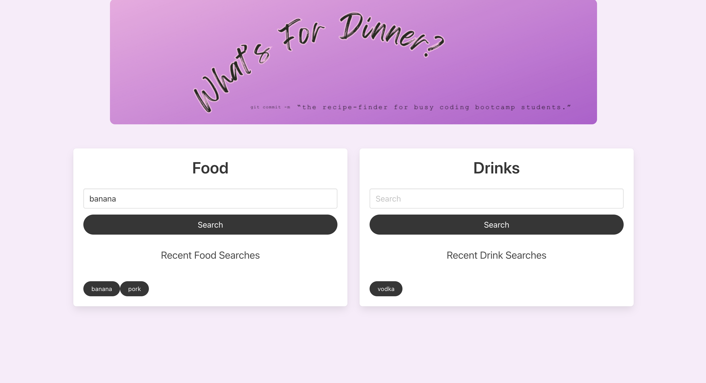

# What’s For Dinner: 
The meal-planner for busy coding bootcamp students.
## Live Link
https://ingridmidia.github.io/recipe-finder/

## User Story
As a busy bootcamp student with limited time to plan my meals, I need quick and easy way to look up food recipies.
## Description:
What’s For Dinner is a web app that helps busy coding bootcamp students (among others) search for recipes featuring a user-provided ingredient. This is a responsive application that uses HTML, CSS, Bulma and JavaScript.
## Credits
Ingrid Miranda - https://github.com/ingridmidia

Liz Fischenich - https://github.com/lizfischstix

Jackson Neuman - https://github.com/jneums81

Chris Kirkley - https://github.com/Peaky00
